# 📊 DBMS Visual Diagrams & Charts

## 🎨 How to Use These Diagrams

These diagrams are written in **Mermaid** syntax. You can:
1. **View in GitHub** - GitHub automatically renders Mermaid diagrams
2. **Use Mermaid Live Editor** - https://mermaid.live/
3. **VS Code Extension** - Install "Markdown Preview Mermaid Support"
4. **Generate Images** - Use tools like mermaid-cli or online converters

---

## 1. Database Entity Relationship Diagram (ERD)

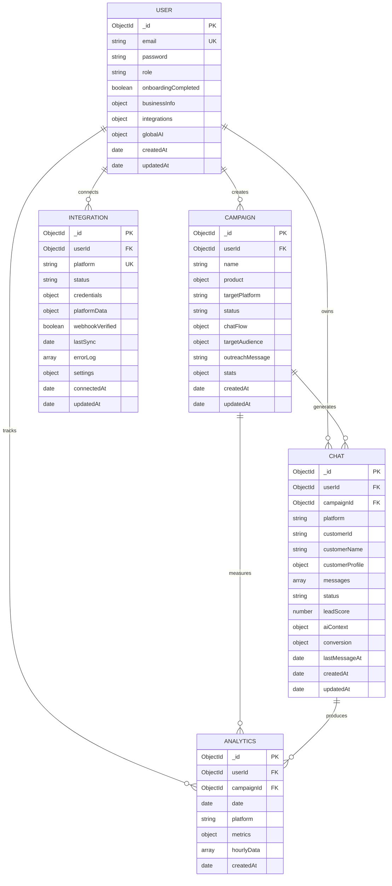
```mermaid
erDiagram
    USER ||--o{ CAMPAIGN : creates
    USER ||--o{ INTEGRATION : connects
    USER ||--o{ CHAT : owns
    USER ||--o{ ANALYTICS : tracks
    CAMPAIGN ||--o{ CHAT : generates
    CAMPAIGN ||--o{ ANALYTICS : measures
    CHAT ||--o{ ANALYTICS : produces
    
    USER {
        ObjectId _id PK
        string email UK
        string password
        string role
        boolean onboardingCompleted
        object businessInfo
        object integrations
        object globalAI
        date createdAt
        date updatedAt
    }
    
    CAMPAIGN {
        ObjectId _id PK
        ObjectId userId FK
        string name
        object product
        string targetPlatform
        string status
        object chatFlow
        object targetAudience
        string outreachMessage
        object stats
        date createdAt
        date updatedAt
    }
    
    CHAT {
        ObjectId _id PK
        ObjectId userId FK
        ObjectId campaignId FK
        string platform
        string customerId
        string customerName
        object customerProfile
        array messages
        string status
        number leadScore
        object aiContext
        object conversion
        date lastMessageAt
        date createdAt
        date updatedAt
    }
    
    ANALYTICS {
        ObjectId _id PK
        ObjectId userId FK
        ObjectId campaignId FK
        date date
        string platform
        object metrics
        array hourlyData
        date createdAt
    }
    
    INTEGRATION {
        ObjectId _id PK
        ObjectId userId FK
        string platform UK
        string status
        object credentials
        object platformData
        boolean webhookVerified
        date lastSync
        array errorLog
        object settings
        date connectedAt
        date updatedAt
    }
```

---

## 2. System Architecture Diagram

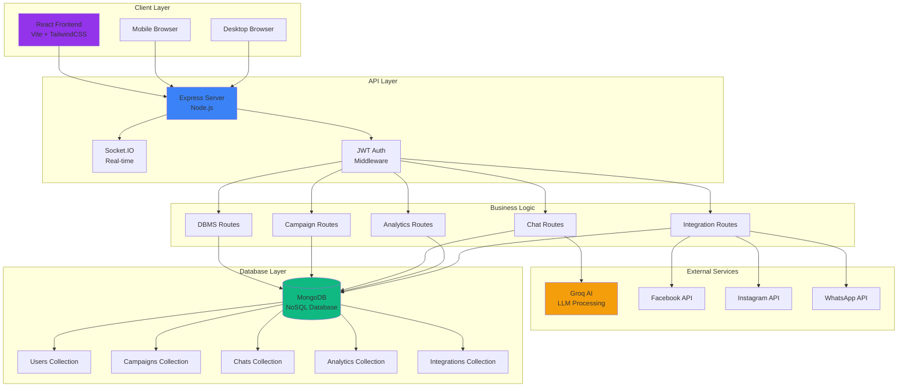
```mermaid
graph TB
    subgraph "Client Layer"
        A[React Frontend<br/>Vite + TailwindCSS]
        B[Mobile Browser]
        C[Desktop Browser]
    end
    
    subgraph "API Layer"
        D[Express Server<br/>Node.js]
        E[Socket.IO<br/>Real-time]
        F[JWT Auth<br/>Middleware]
    end
    
    subgraph "Business Logic"
        G[DBMS Routes]
        H[Campaign Routes]
        I[Chat Routes]
        J[Analytics Routes]
        K[Integration Routes]
    end
    
    subgraph "External Services"
        L[Groq AI<br/>LLM Processing]
        M[Facebook API]
        N[Instagram API]
        O[WhatsApp API]
    end
    
    subgraph "Database Layer"
        P[(MongoDB<br/>NoSQL Database)]
        Q[Users Collection]
        R[Campaigns Collection]
        S[Chats Collection]
        T[Analytics Collection]
        U[Integrations Collection]
    end
    
    A --> D
    B --> D
    C --> D
    D --> E
    D --> F
    F --> G
    F --> H
    F --> I
    F --> J
    F --> K
    
    G --> P
    H --> P
    I --> P
    J --> P
    K --> P
    
    P --> Q
    P --> R
    P --> S
    P --> T
    P --> U
    
    I --> L
    K --> M
    K --> N
    K --> O
    
    style A fill:#9333ea
    style D fill:#3b82f6
    style P fill:#10b981
    style L fill:#f59e0b
```

---

## 3. Data Flow Diagram - Message Processing

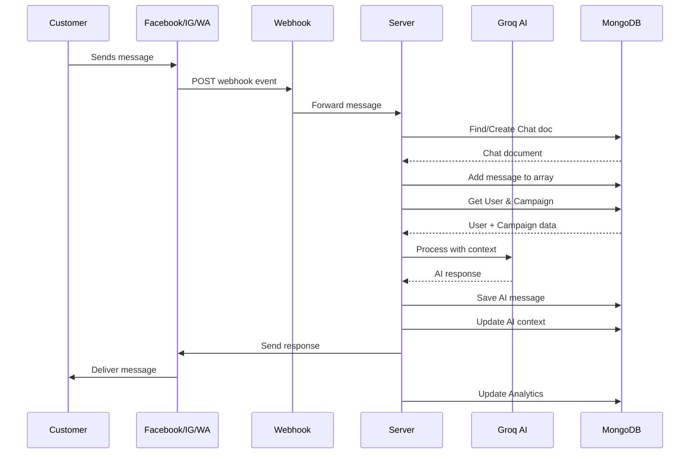
```mermaid
sequenceDiagram
    participant C as Customer
    participant FB as Facebook/IG/WA
    participant W as Webhook
    participant S as Server
    participant AI as Groq AI
    participant DB as MongoDB
    
    C->>FB: Sends message
    FB->>W: POST webhook event
    W->>S: Forward message
    S->>DB: Find/Create Chat doc
    DB-->>S: Chat document
    S->>DB: Add message to array
    S->>DB: Get User & Campaign
    DB-->>S: User + Campaign data
    S->>AI: Process with context
    AI-->>S: AI response
    S->>DB: Save AI message
    S->>DB: Update AI context
    S->>FB: Send response
    FB->>C: Deliver message
    S->>DB: Update Analytics
```

---

## 4. Authentication Flow

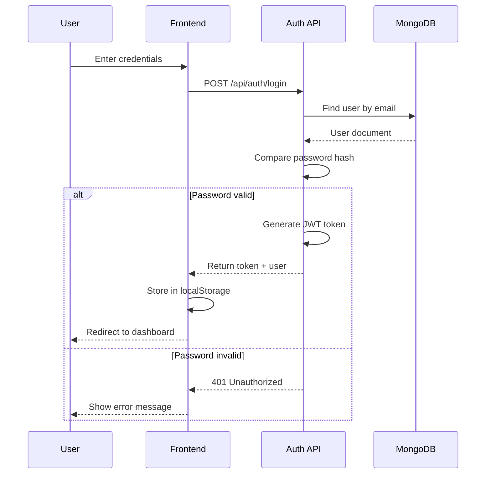
```mermaid
sequenceDiagram
    participant U as User
    participant F as Frontend
    participant A as Auth API
    participant DB as MongoDB
    
    U->>F: Enter credentials
    F->>A: POST /api/auth/login
    A->>DB: Find user by email
    DB-->>A: User document
    A->>A: Compare password hash
    alt Password valid
        A->>A: Generate JWT token
        A-->>F: Return token + user
        F->>F: Store in localStorage
        F-->>U: Redirect to dashboard
    else Password invalid
        A-->>F: 401 Unauthorized
        F-->>U: Show error message
    end
```

---

## 5. DBMS Operations Flow

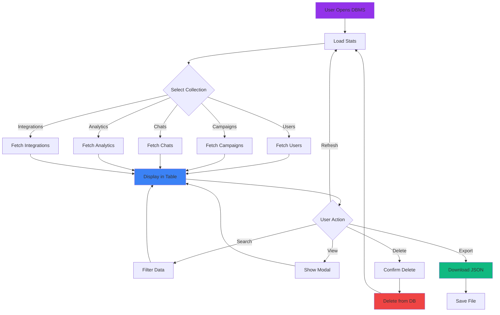
```mermaid
flowchart TD
    A[User Opens DBMS] --> B[Load Stats]
    B --> C{Select Collection}
    C -->|Users| D[Fetch Users]
    C -->|Campaigns| E[Fetch Campaigns]
    C -->|Chats| F[Fetch Chats]
    C -->|Analytics| G[Fetch Analytics]
    C -->|Integrations| H[Fetch Integrations]
    
    D --> I[Display in Table]
    E --> I
    F --> I
    G --> I
    H --> I
    
    I --> J{User Action}
    J -->|Search| K[Filter Data]
    J -->|View| L[Show Modal]
    J -->|Delete| M[Confirm Delete]
    J -->|Export| N[Download JSON]
    J -->|Refresh| B
    
    K --> I
    L --> I
    M --> O[Delete from DB]
    O --> B
    N --> P[Save File]
    
    style A fill:#9333ea
    style I fill:#3b82f6
    style O fill:#ef4444
    style N fill:#10b981
```

---

## 6. Collection Relationships

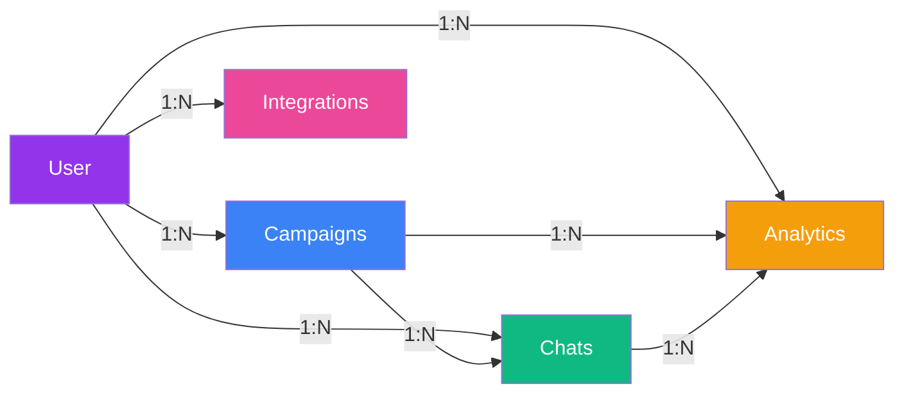
```mermaid
graph LR
    U[User] -->|1:N| C[Campaigns]
    U -->|1:N| I[Integrations]
    U -->|1:N| CH[Chats]
    U -->|1:N| A[Analytics]
    C -->|1:N| CH
    C -->|1:N| A
    CH -->|1:N| A
    
    style U fill:#9333ea,color:#fff
    style C fill:#3b82f6,color:#fff
    style CH fill:#10b981,color:#fff
    style A fill:#f59e0b,color:#fff
    style I fill:#ec4899,color:#fff
```

---

## 7. Campaign Lifecycle

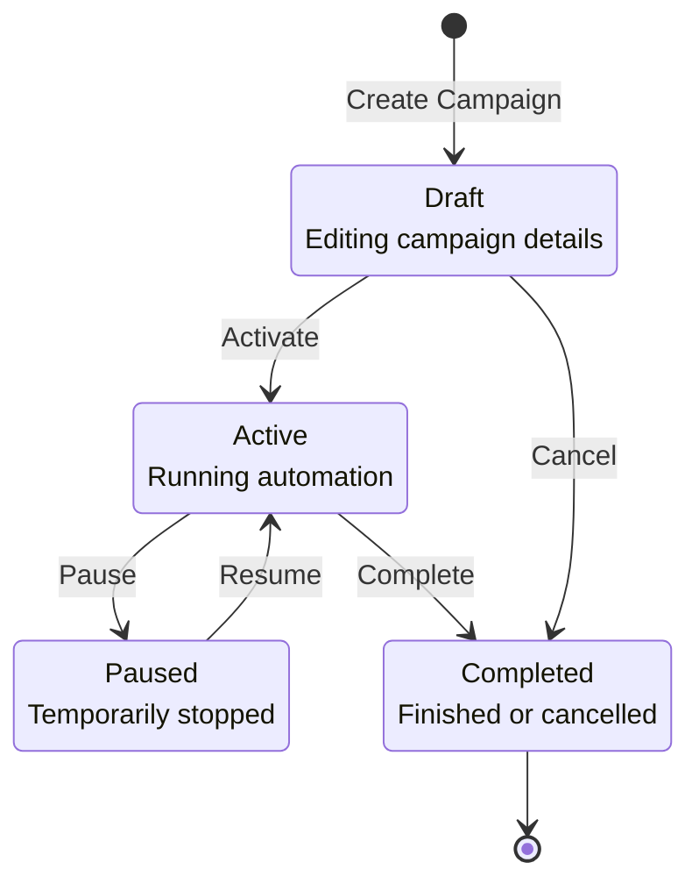
```mermaid
stateDiagram-v2
    [*] --> Draft: Create Campaign
    Draft --> Active: Activate
    Active --> Paused: Pause
    Paused --> Active: Resume
    Active --> Completed: Complete
    Draft --> Completed: Cancel
    Completed --> [*]
    
    Draft: Draft<br/>Editing campaign details
    Active: Active<br/>Running automation
    Paused: Paused<br/>Temporarily stopped
    Completed: Completed<br/>Finished or cancelled
```

---

## 8. Chat Status Lifecycle

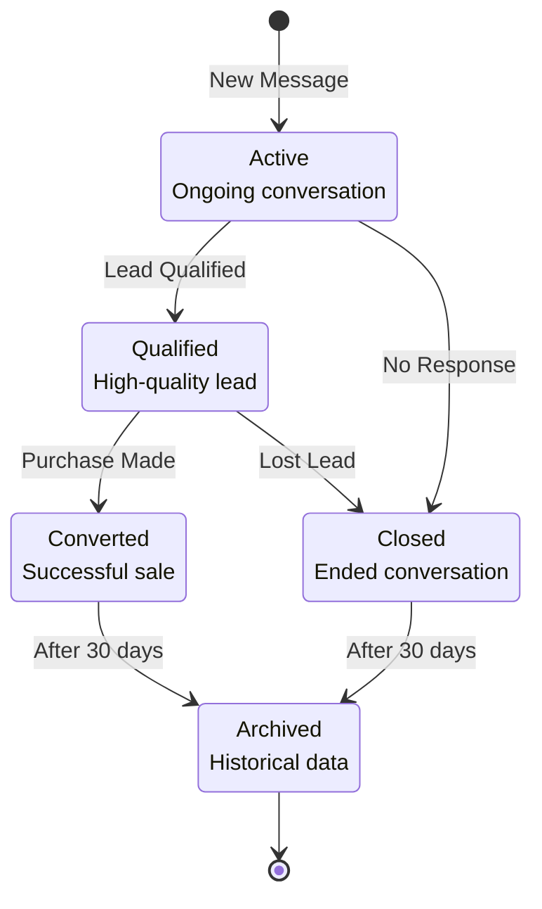
```mermaid
stateDiagram-v2
    [*] --> Active: New Message
    Active --> Qualified: Lead Qualified
    Active --> Closed: No Response
    Qualified --> Converted: Purchase Made
    Qualified --> Closed: Lost Lead
    Converted --> Archived: After 30 days
    Closed --> Archived: After 30 days
    Archived --> [*]
    
    Active: Active<br/>Ongoing conversation
    Qualified: Qualified<br/>High-quality lead
    Converted: Converted<br/>Successful sale
    Closed: Closed<br/>Ended conversation
    Archived: Archived<br/>Historical data
```

---

## 9. Integration Status Flow

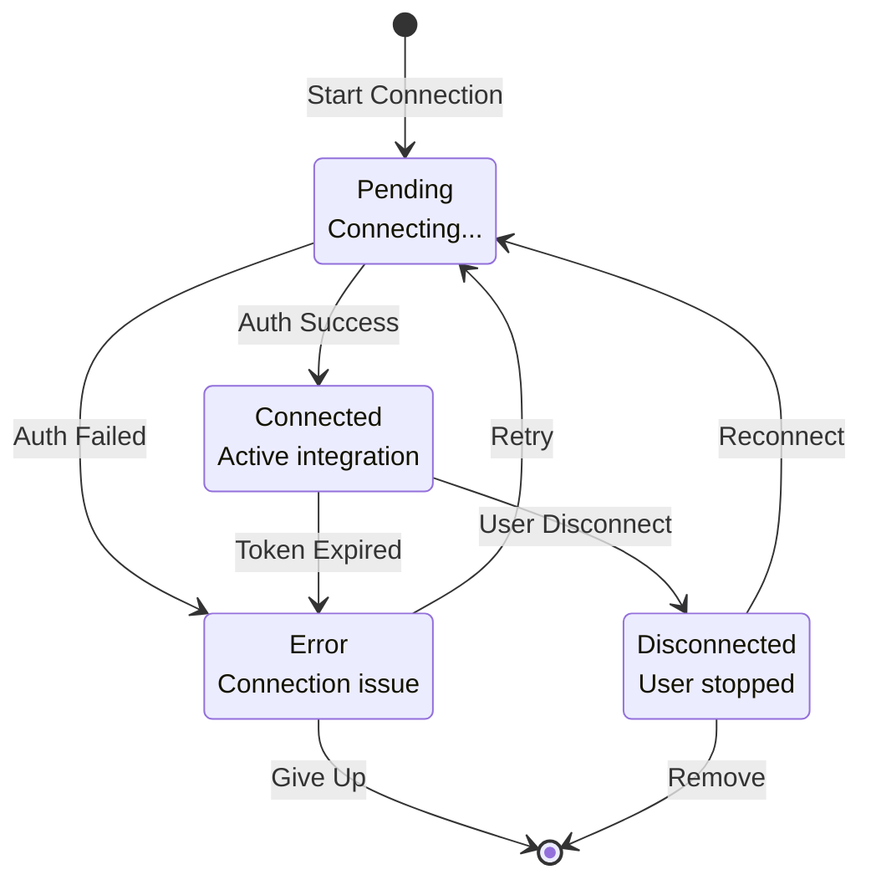
```mermaid
stateDiagram-v2
    [*] --> Pending: Start Connection
    Pending --> Connected: Auth Success
    Pending --> Error: Auth Failed
    Connected --> Disconnected: User Disconnect
    Connected --> Error: Token Expired
    Error --> Pending: Retry
    Disconnected --> Pending: Reconnect
    Error --> [*]: Give Up
    Disconnected --> [*]: Remove
    
    Pending: Pending<br/>Connecting...
    Connected: Connected<br/>Active integration
    Disconnected: Disconnected<br/>User stopped
    Error: Error<br/>Connection issue
```

---

## 10. Analytics Data Aggregation

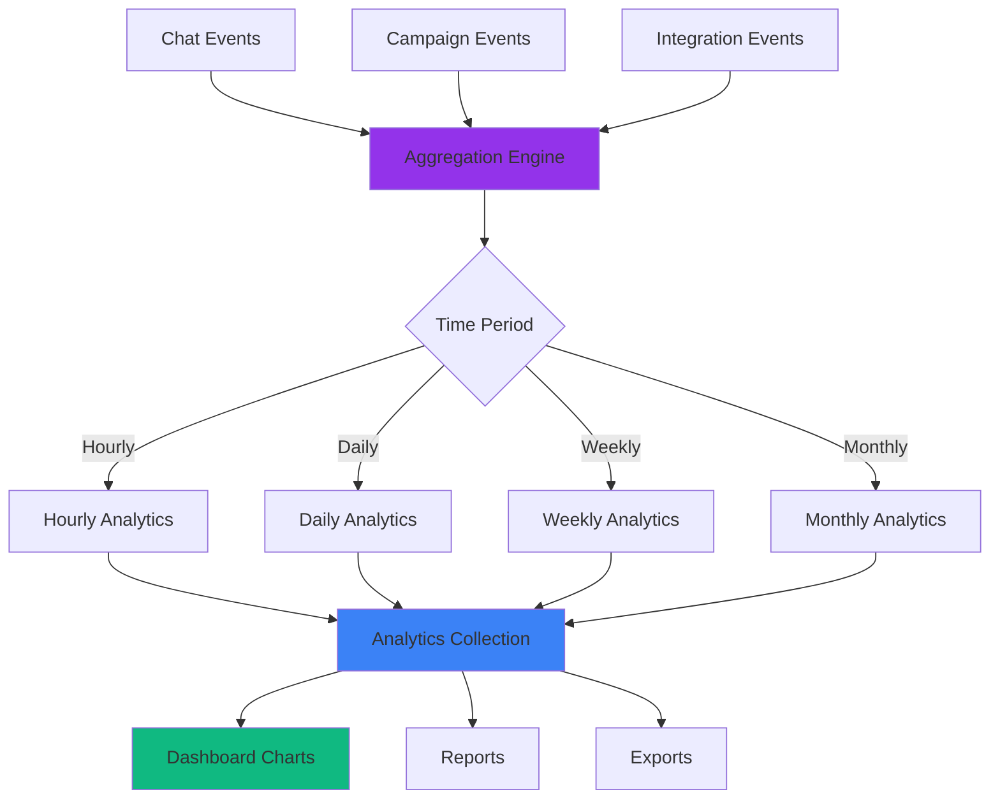
```mermaid
flowchart TB
    A[Chat Events] --> D[Aggregation Engine]
    B[Campaign Events] --> D
    C[Integration Events] --> D
    
    D --> E{Time Period}
    E -->|Hourly| F[Hourly Analytics]
    E -->|Daily| G[Daily Analytics]
    E -->|Weekly| H[Weekly Analytics]
    E -->|Monthly| I[Monthly Analytics]
    
    F --> J[Analytics Collection]
    G --> J
    H --> J
    I --> J
    
    J --> K[Dashboard Charts]
    J --> L[Reports]
    J --> M[Exports]
    
    style D fill:#9333ea
    style J fill:#3b82f6
    style K fill:#10b981
```

---

## 11. Database Indexing Strategy

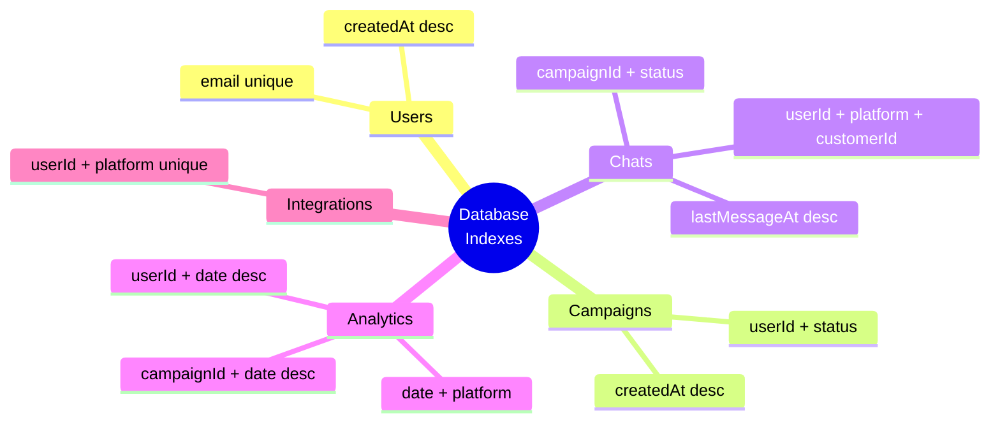
```mermaid
mindmap
  root((Database<br/>Indexes))
    Users
      email unique
      createdAt desc
    Campaigns
      userId + status
      createdAt desc
    Chats
      userId + platform + customerId
      campaignId + status
      lastMessageAt desc
    Analytics
      userId + date desc
      campaignId + date desc
      date + platform
    Integrations
      userId + platform unique
```

---

## 12. Security Layers

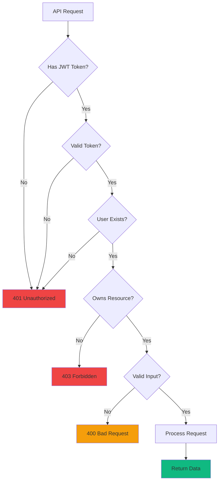
```mermaid
graph TD
    A[API Request] --> B{Has JWT Token?}
    B -->|No| C[401 Unauthorized]
    B -->|Yes| D{Valid Token?}
    D -->|No| C
    D -->|Yes| E{User Exists?}
    E -->|No| C
    E -->|Yes| F{Owns Resource?}
    F -->|No| G[403 Forbidden]
    F -->|Yes| H{Valid Input?}
    H -->|No| I[400 Bad Request]
    H -->|Yes| J[Process Request]
    J --> K[Return Data]
    
    style C fill:#ef4444
    style G fill:#ef4444
    style I fill:#f59e0b
    style K fill:#10b981
```

---

## 13. Backup & Recovery Strategy

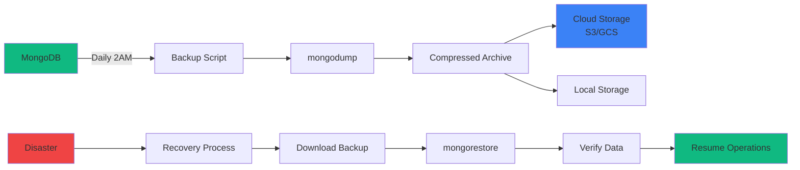
```mermaid
flowchart LR
    A[MongoDB] -->|Daily 2AM| B[Backup Script]
    B --> C[mongodump]
    C --> D[Compressed Archive]
    D --> E[Cloud Storage<br/>S3/GCS]
    D --> F[Local Storage]
    
    G[Disaster] --> H[Recovery Process]
    H --> I[Download Backup]
    I --> J[mongorestore]
    J --> K[Verify Data]
    K --> L[Resume Operations]
    
    style A fill:#10b981
    style E fill:#3b82f6
    style G fill:#ef4444
    style L fill:#10b981
```

---

## 14. Performance Monitoring

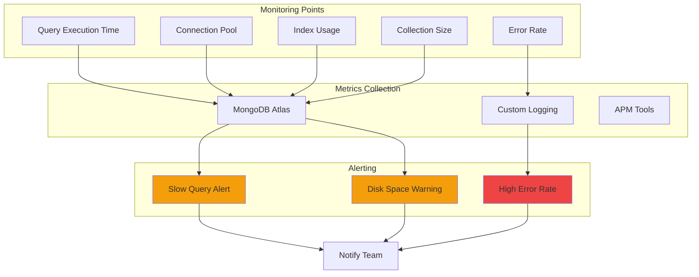
```mermaid
graph TB
    subgraph "Monitoring Points"
        A[Query Execution Time]
        B[Connection Pool]
        C[Index Usage]
        D[Collection Size]
        E[Error Rate]
    end
    
    subgraph "Metrics Collection"
        F[MongoDB Atlas]
        G[Custom Logging]
        H[APM Tools]
    end
    
    subgraph "Alerting"
        I[Slow Query Alert]
        J[High Error Rate]
        K[Disk Space Warning]
    end
    
    A --> F
    B --> F
    C --> F
    D --> F
    E --> G
    
    F --> I
    G --> J
    F --> K
    
    I --> L[Notify Team]
    J --> L
    K --> L
    
    style I fill:#f59e0b
    style J fill:#ef4444
    style K fill:#f59e0b
```

---

## 15. Scaling Architecture

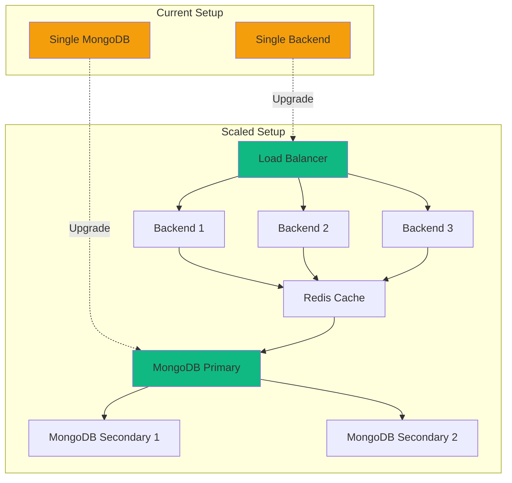
```mermaid
graph TB
    subgraph "Current Setup"
        A[Single Backend]
        B[Single MongoDB]
    end
    
    subgraph "Scaled Setup"
        C[Load Balancer]
        D[Backend 1]
        E[Backend 2]
        F[Backend 3]
        G[Redis Cache]
        H[MongoDB Primary]
        I[MongoDB Secondary 1]
        J[MongoDB Secondary 2]
    end
    
    A -.Upgrade.-> C
    B -.Upgrade.-> H
    
    C --> D
    C --> E
    C --> F
    
    D --> G
    E --> G
    F --> G
    
    G --> H
    H --> I
    H --> J
    
    style A fill:#f59e0b
    style B fill:#f59e0b
    style C fill:#10b981
    style H fill:#10b981
```

---

## 16. AI Processing Pipeline

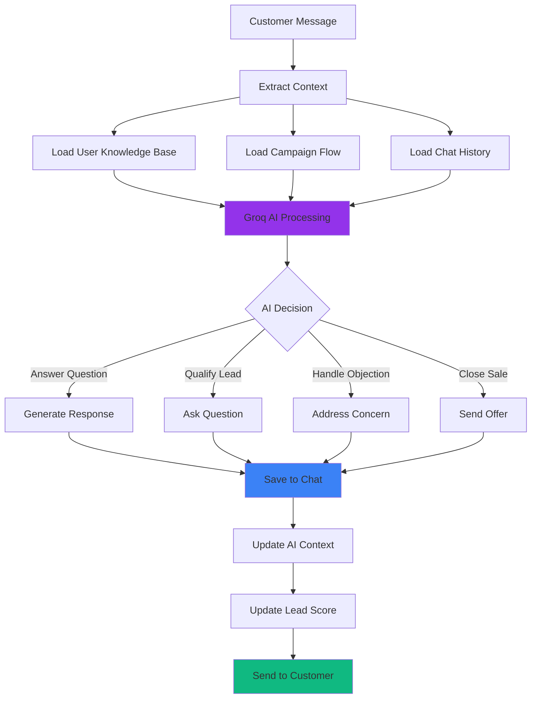
```mermaid
flowchart TD
    A[Customer Message] --> B[Extract Context]
    B --> C[Load User Knowledge Base]
    B --> D[Load Campaign Flow]
    B --> E[Load Chat History]
    
    C --> F[Groq AI Processing]
    D --> F
    E --> F
    
    F --> G{AI Decision}
    G -->|Answer Question| H[Generate Response]
    G -->|Qualify Lead| I[Ask Question]
    G -->|Handle Objection| J[Address Concern]
    G -->|Close Sale| K[Send Offer]
    
    H --> L[Save to Chat]
    I --> L
    J --> L
    K --> L
    
    L --> M[Update AI Context]
    M --> N[Update Lead Score]
    N --> O[Send to Customer]
    
    style F fill:#9333ea
    style L fill:#3b82f6
    style O fill:#10b981
```

---

## 17. Export/Import Data Flow

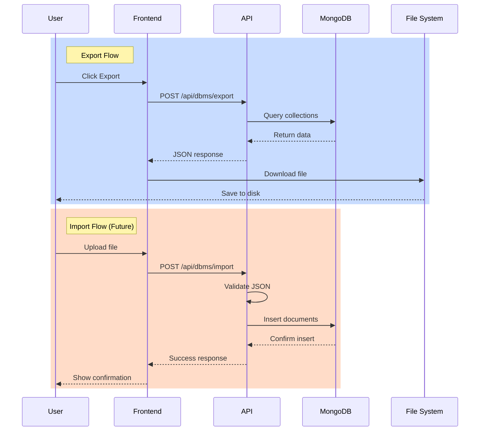
```mermaid
sequenceDiagram
    participant U as User
    participant F as Frontend
    participant A as API
    participant DB as MongoDB
    participant FS as File System
    
    rect rgb(200, 220, 255)
        note right of U: Export Flow
        U->>F: Click Export
        F->>A: POST /api/dbms/export
        A->>DB: Query collections
        DB-->>A: Return data
        A-->>F: JSON response
        F->>FS: Download file
        FS-->>U: Save to disk
    end
    
    rect rgb(255, 220, 200)
        note right of U: Import Flow (Future)
        U->>F: Upload file
        F->>A: POST /api/dbms/import
        A->>A: Validate JSON
        A->>DB: Insert documents
        DB-->>A: Confirm insert
        A-->>F: Success response
        F-->>U: Show confirmation
    end
```

---

## 18. Real-time Updates with Socket.IO

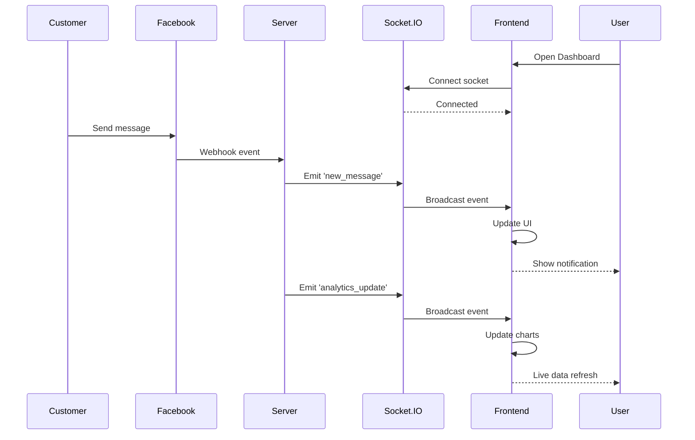
```mermaid
sequenceDiagram
    participant C as Customer
    participant FB as Facebook
    participant S as Server
    participant IO as Socket.IO
    participant F as Frontend
    participant U as User
    
    U->>F: Open Dashboard
    F->>IO: Connect socket
    IO-->>F: Connected
    
    C->>FB: Send message
    FB->>S: Webhook event
    S->>IO: Emit 'new_message'
    IO->>F: Broadcast event
    F->>F: Update UI
    F-->>U: Show notification
    
    S->>IO: Emit 'analytics_update'
    IO->>F: Broadcast event
    F->>F: Update charts
    F-->>U: Live data refresh
```

---

## 19. Database Schema Validation

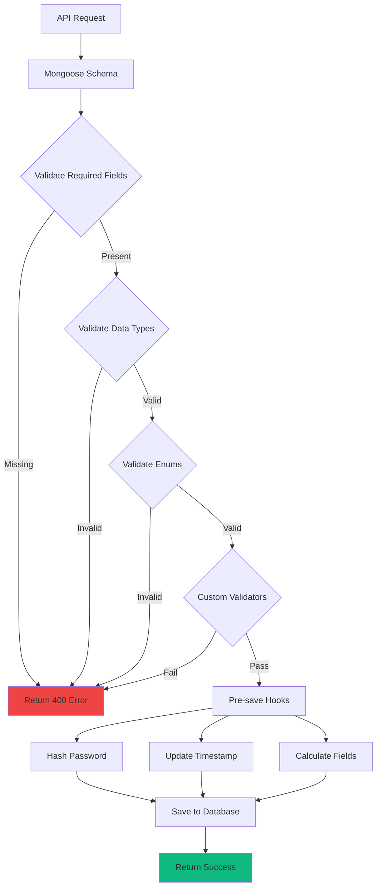
```mermaid
flowchart TD
    A[API Request] --> B[Mongoose Schema]
    B --> C{Validate Required Fields}
    C -->|Missing| D[Return 400 Error]
    C -->|Present| E{Validate Data Types}
    E -->|Invalid| D
    E -->|Valid| F{Validate Enums}
    F -->|Invalid| D
    F -->|Valid| G{Custom Validators}
    G -->|Fail| D
    G -->|Pass| H[Pre-save Hooks]
    H --> I[Hash Password]
    H --> J[Update Timestamp]
    H --> K[Calculate Fields]
    I --> L[Save to Database]
    J --> L
    K --> L
    L --> M[Return Success]
    
    style D fill:#ef4444
    style M fill:#10b981
```

---

## 20. Complete System Overview

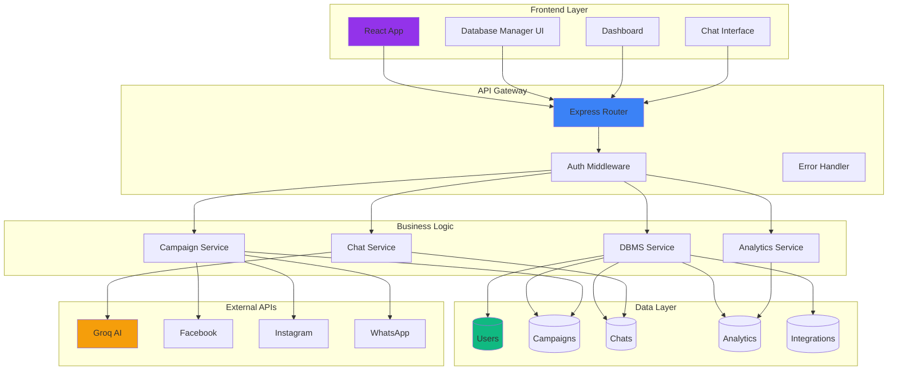
```mermaid
graph TB
    subgraph "Frontend Layer"
        A[React App]
        B[Database Manager UI]
        C[Dashboard]
        D[Chat Interface]
    end
    
    subgraph "API Gateway"
        E[Express Router]
        F[Auth Middleware]
        G[Error Handler]
    end
    
    subgraph "Business Logic"
        H[DBMS Service]
        I[Campaign Service]
        J[Chat Service]
        K[Analytics Service]
    end
    
    subgraph "Data Layer"
        L[(Users)]
        M[(Campaigns)]
        N[(Chats)]
        O[(Analytics)]
        P[(Integrations)]
    end
    
    subgraph "External APIs"
        Q[Groq AI]
        R[Facebook]
        S[Instagram]
        T[WhatsApp]
    end
    
    A --> E
    B --> E
    C --> E
    D --> E
    
    E --> F
    F --> H
    F --> I
    F --> J
    F --> K
    
    H --> L
    H --> M
    H --> N
    H --> O
    H --> P
    
    I --> M
    J --> N
    J --> Q
    K --> O
    
    I --> R
    I --> S
    I --> T
    
    style A fill:#9333ea
    style E fill:#3b82f6
    style L fill:#10b981
    style Q fill:#f59e0b
```

---

## 📝 How to Generate Images from These Diagrams

### **Method 1: Mermaid Live Editor**
1. Go to https://mermaid.live/
2. Copy any diagram code above
3. Paste into the editor
4. Click "Download PNG/SVG"

### **Method 2: VS Code**
1. Install "Markdown Preview Mermaid Support" extension
2. Open this file in VS Code
3. Press `Ctrl+Shift+V` to preview
4. Right-click diagram → "Copy Image"

### **Method 3: GitHub**
1. Push this file to GitHub
2. View in GitHub (auto-renders Mermaid)
3. Take screenshot or use GitHub's export

### **Method 4: CLI Tool**
```bash
npm install -g @mermaid-js/mermaid-cli
mmdc -i DBMS_DIAGRAMS.md -o output.png
```

### **Method 5: Online Tools**
- https://mermaid.ink/
- https://kroki.io/
- https://www.diagram.codes/

---

## 🎨 Diagram Color Legend

- 🟣 **Purple (#9333ea)** - Frontend/User Interface
- 🔵 **Blue (#3b82f6)** - Backend/API Layer
- 🟢 **Green (#10b981)** - Database/Success States
- 🟠 **Orange (#f59e0b)** - External Services/Warnings
- 🔴 **Red (#ef4444)** - Errors/Failures
- 🩷 **Pink (#ec4899)** - Integrations

---

**All diagrams are ready to be used in presentations, documentation, or AI tools like ChatGPT/Claude for further visualization!**
